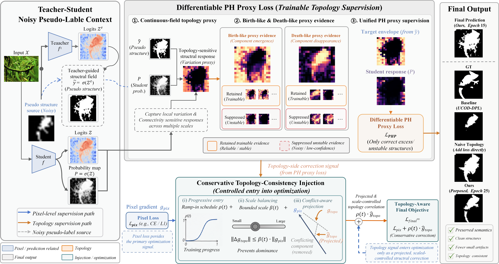

# LPHP

Anonymous minimal code release for reproducibility.

This repository provides a minimal runnable implementation of the differentiable PH proxy loss used in the submitted paper.

## Repository Structure

```text
LPHP/
├─ README.md
├─ demo_topo_addon.py
├─ LPHP/
│  ├─ __init__.py
│  ├─ interfaces.py
│  ├─ loss.py
│  ├─ ph.py
│  └─ utils.py
└─ Fig/
   └─ Methods.png
````

## Environment

A minimal Python environment with PyTorch is sufficient.

```bash
conda create -n lphp python=3.10 -y
conda activate lphp
pip install torch
```

If a CUDA-enabled GPU is available, install the PyTorch build corresponding to your platform and CUDA version.

## Run the Demo

From the repository root, run:

```bash
python demo_topo_addon.py
```

The demo constructs random student and teacher logits, evaluates the current `topo_addon`, and verifies that the backward pass runs successfully.

## Method Overview



## Notes

* This is a minimal anonymous release for reproducibility.
* It is not intended to reproduce the full training framework of the paper.
